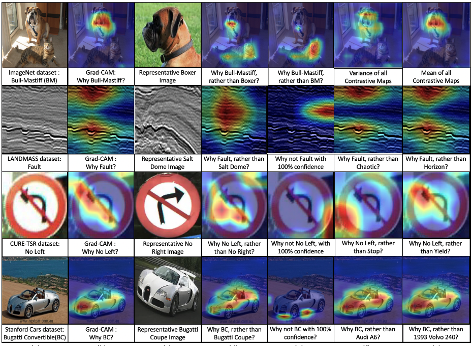

# Contrastive Explanations in Neural Networks

**Abstract**. 

Visual explanations are logical arguments based on visual features that justify the predictions made by neural networks. Current modes of visual explanations answer questions of the form *‘Why P?’*. These *Why* questions operate under broad contexts thereby providing answers that are irrelevant in some cases. We propose to constrain these *Why* questions based on some context *Q* so that our explanations answer contrastive questions of the form *‘Why P, rather than Q?’*. In this paper, we formalize the structure of contrastive visual explanations for neural networks. We define contrast based on neural networks and propose a methodology to extract defined contrasts. We then use the extracted contrasts as a plug-in on top of existing *‘Why P?’* techniques, specifically Grad-CAM. We demonstrate their value in analyzing both networks and data in applications of large-scale recognition, fine-grained recognition, subsurface seismic analysis, and image quality assessment.  

 

The last four columns display the contrastive explanations.  

**Paper** : https://arxiv.org/abs/2008.00178 

**Code Acknowledgements** :  The code is built on Grad-CAM. We use the implementation of **https://github.com/1Konny/gradcam_plus_plus-pytorch** as our base code. Specifically, Recognition/utils.py and Recognition/gradcam.py are adapted. For the application of Image Quality Assessment, we use pretrained networks and network architecture from **https://github.com/lidq92/WaDIQaM**. Specifically, Image Quality Assessment/IQA.py and Image Quality Assessment/checkpoints are used.

**Citation** : Prabhushankar, M., Kwon, G., Temel, D., & AlRegib, G. (2020, October). Contrastive explanations in neural networks. In 2020 IEEE International Conference on Image Processing (ICIP) (pp. 3289-3293). IEEE.

**Bibtex** : @inproceedings{prabhushankar2020contrastive,
  title={Contrastive explanations in neural networks},
  author={Prabhushankar, Mohit and Kwon, Gukyeong and Temel, Dogancan and AlRegib, Ghassan},
  booktitle={2020 IEEE International Conference on Image Processing (ICIP)},
  pages={3289--3293},
  year={2020},
  organization={IEEE}
}
