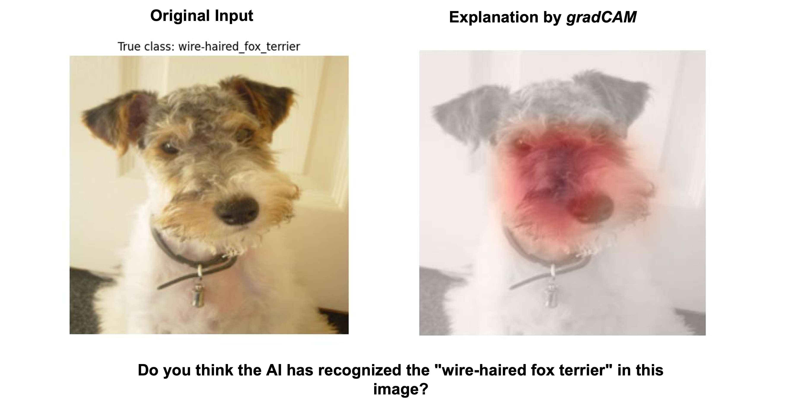

# Development (TODO: Change Repo Name)

## Description
This repository contains the code to generate the questionnaire that was conducted for the sake of our paper *Study on the Helpfulness of Explainable Artificial Intelligence (2022)* as well as the scripts for the analysis of the gathered survey results. New randomly generated questionnaires on the basis of the chosen XAI-methods and dataset (described below) can be easily generated as well. 

In our work we specifically examined the question how far the chosen XAI-methods *Confidence Scores,* *LRP*, *gradCAM*, *Integrated Gradients*, *LIME* and *SHAP* enable a user to correctly identify whether a model (*AlexNet* or *VGG16*) classified randomly chosen images from the *imagenetv2-matched-frequency* dataset correctly. For the decision whether to trust or distrust the model, the participants were only given the generated explanation by one of the XAI-methods but not the actual predicted class of the model.\
An example question consisting of the original image alongside the explanation image generated by *gradCAM* can be seen below:




A complete *questionnaire* that is generated by this repository is represented by a folder containing twelve subfolders representing  different questionnaire forms. Each of those subfolders contains the actual questions (original and corresponding explanation images). For further information on the survey design and questionnaire generation procedure we refer to our paper *Study on the Helpfulness of Explainable Artificial Intelligence (2022)* section *III) Methodology D) Survey Design*.


## Project structure

├── analysis # contains jupyter notebooks for survey results analysis\
│   ├── questionaire_analyzer_confusionMatrix.ipynb\
│   ├── questionnaire_data_preparation.ipynb\
│   ├── questionnaire_metrics_calculator.ipynb\
│   ├── questionnaire_participants_statistics_charts.ipynb\
│   └── test_set_analyzer.ipynb\
├── data\
│   ├── question_generation\
│   ├── stats\
│   ├── survey_results\
│   └── imagenet_class_index.json\
├── methods \
│   ├── LRP.py\
│   ├── SHAP.py\
│   ├── confidence_scores.py\
│   ├── gradcam.py\
│   ├── integrated_gradients.py\
│   └── lime.py\
├── questionnaire_forms_conducted_survey\
├── README.md\
├── data_handler.py\
├── experiment_creator.py /* creates */\ 
├── main.py\
├── models.py\
└── requirements.txt

## Setup
1. Clone the repository.
2. Create a virtual environment, activate it  and install the packages defined in *requirments.txt* via ```pip install -r requirements.txt```.
3. Download the *imagenetv2-matched-frequency* dataset from http://imagenetv2public.s3-website-us-west-2.amazonaws.com/ and paste the unpacked folder (leave folder name unchanged) in the *data* folder of the project structure. For more information on this dataset we refer to https://github.com/modestyachts/ImageNetV2.

## Usage

### Recreation of questionnaire (forms) used in conducted survey
***Remark***: *All images that are generated by the following steps can be found in the directory "questionnaire_forms_conducted_survey". Thus there is no explicit need for executing the following steps if time and computational resources need to be saved.*
1. Simply run the main.py file to generate the questions for all methods. If questions for certain XAI-method(s) should not be generated, run the main.py file and set the corresponding parameter(s) (--LRP, --gradCam, --LIME, --IntGrad, --CS, --SAHP) to *False*. For example ```python main.py --LIME False --CS False``` will generate all questions  
2. Recreate only specific xai-method questions (reduced computation time)
3. Generate new questionnaire 
### Creation of new randomly generated questionnaire (forms) 

## Authors and acknowledgment
Show your appreciation to those who have contributed to the project.

## License
For open source projects, say how it is licensed.

