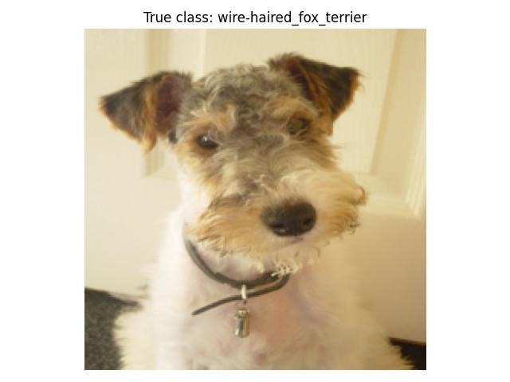
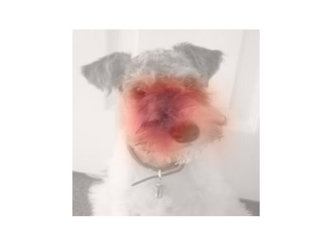

# Development (TODO: Change Repo Name)

## Description
This repository contains the code to generate the questionnaire that was conducted for the sake of our paper *Study on the Helpfulness of Explainable Artificial Intelligence (2022)* as well as the scripts for the analysis of the gathered survey results. New randomly generated questionnaires on the basis of the chosen XAI-methods and dataset (described below) can be easily generated as well. 

In our work we specifically examined the question how far the chosen XAI-methods *Confidence Scores,* *LRP*, *gradCAM*, *Integrated Gradients*, *LIME* and *SHAP* enable a user to correctly identify whether a model (*AlexNet* or *VGG16*) classified randomly chosen images from the *imagenetv2-matched-frequency* dataset correctly. For the decision whether to trust or distrust the model, the participants were only given the generated explanation by one of the XAI-methods but not the actual predicted class of the model.\
An example question consisting of the original image alongside the explanation image generated by *gradCAM* can be seen below:
| Original              |  gradCAM Explanation |
:-------------------------:|:-------------------------:
|  |  |

|  |
|:-:|
|**Do you think the AI has recognized the "wire-haired fox terrier" in this image?**|

A complete *questionnaire* that is generated by this repository is represented by a folder containing twelve subfolders representing  different questionnaire forms. Each of those subfolders contains the actual questions that come in the form images. For further information on the survey design and questionnaire generation procedure we refer to our paper *Study on the Helpfulness of Explainable Artificial Intelligence (2022)* section *III) Methodology D) Survey Design*.

## Project structure

├── analysis /* contains jupyter notebooks for analysing survey results */\
│   ├── questionaire_analyzer_confusionMatrix.ipynb\
│   ├── questionnaire_data_preparation.ipynb\
│   ├── questionnaire_metrics_calculator.ipynb\
│   ├── questionnaire_participants_statistics_charts.ipynb\
│   └── test_set_analyzer.ipynb\
├── data\
│   ├── question_generation\
│   ├── stats\
│   ├── survey_results\
│   └── imagenet_class_index.json\
├── methods \
│   ├── LRP.py\
│   ├── SHAP.py\
│   ├── confidence_scores.py\
│   ├── gradcam.py\
│   ├── integrated_gradients.py\
│   └── lime.py\
├── questionaire_forms_conducted_survey\
├── README.md\
├── data_handler.py\
├── experiment_creator.py\
├── main.py\
├── models.py\
└── requirements.txt

## Usage
1. Clone the repository.
2. Create a virtual environment, activate it  and install the packages defined in *requirments.txt* via `pip install -r requirements.txt`.
3. Download the *imagenetv2-matched-frequency* dataset from http://imagenetv2public.s3-website-us-west-2.amazonaws.com/ and paste the unpacked folder in the *data* folder of the project structure. For more information on this dataset we refer to https://github.com/modestyachts/ImageNetV2.
4. To recreate the exact same questionnaire forms of the conducted survey either run the main.py file or use the following command in your command line tool: TODO
5. Recreate only specific xai-method questions (reduced computation time)
6. Generate new questionnaire 

## Installation
Within a particular ecosystem, there may be a common way of installing things, such as using Yarn, NuGet, or Homebrew. However, consider the possibility that whoever is reading your README is a novice and would like more guidance. Listing specific steps helps remove ambiguity and gets people to using your project as quickly as possible. If it only runs in a specific context like a particular programming language version or operating system or has dependencies that have to be installed manually, also add a Requirements subsection.

## Usage
Use examples liberally, and show the expected output if you can. It's helpful to have inline the smallest example of usage that you can demonstrate, while providing links to more sophisticated examples if they are too long to reasonably include in the README.

## Authors and acknowledgment
Show your appreciation to those who have contributed to the project.

## License
For open source projects, say how it is licensed.

