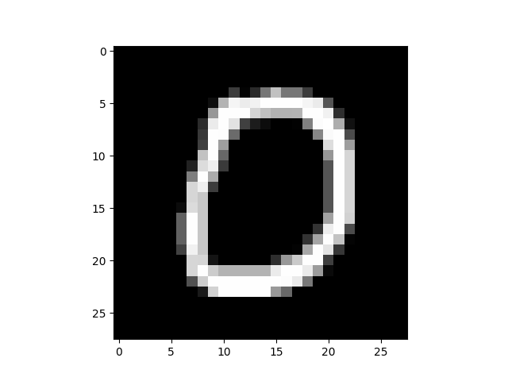
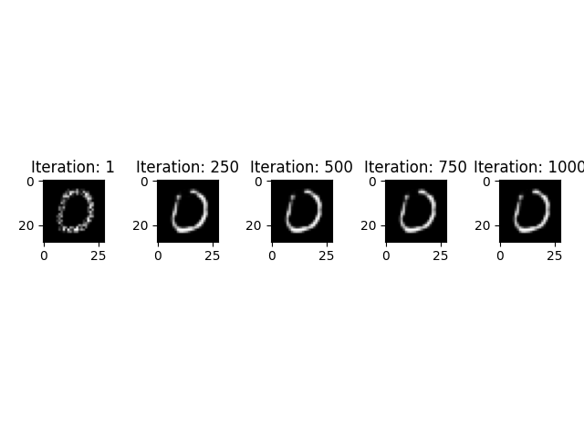
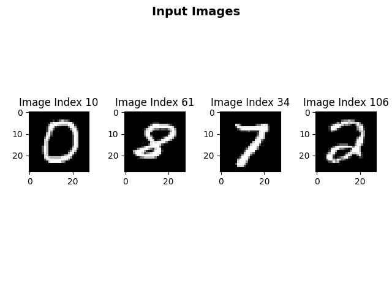
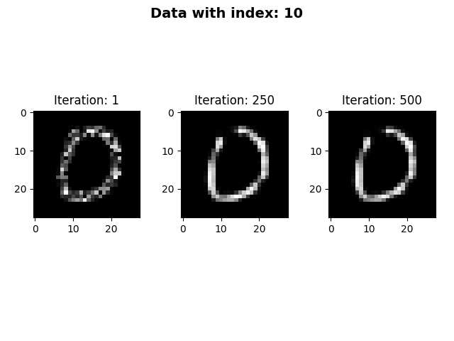
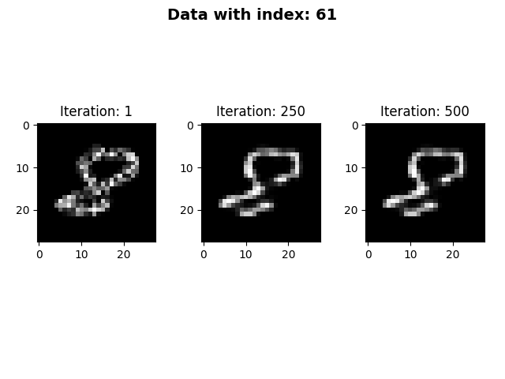
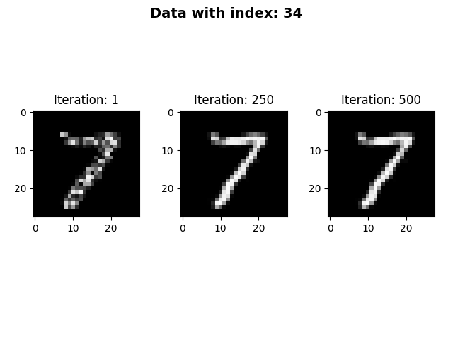
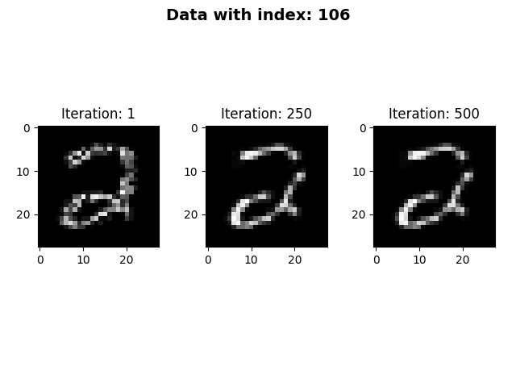

# Minimal Effort Example with CEM on MNIST

Suppose you want to generate the pertinent positive explanation (_CEM_) of a handwritten digit from the _MNIST dataset_. First and foremost, you have to make sure of the following things:

- You have the dataset and an inference model accessible.
- As we will utilize the _Contrastive Explanation Method_, it is necessary that the prediction result is of a classification problem format, e.g. `[0.1, 5.23, 2.34, 12.01]` - where each entry indicates the score of likelihood of the class being present in the image.

<details open>
<summary>Our model prediction for the image in <b>step three</b> below:</summary>

```
[ 34.32501    -12.048843     1.2531171   -8.700068    -8.913591
  -5.9139457    0.26711565  -2.6489842   -0.33851495   2.3089695 ]
```

</details>

Since the provided inference model ouputs the right format, we don't need to include the _Inference Wrapper_. Now we can start writing the code:

1. Import the required libraries:

```python
import numpy as np
import maxi
import matplotlib.pyplot as plt

from mnist_tf.utils import setup_mnist
```

2. Load the mnist data, model and autoencoder:

```python
def main():
    data, model, AE = setup_mnist(
        model_path="./experiments/mnist/models/mnist",
        ae_path="./experiments/mnist/models/AE_codec",
    )
```

3. Chose an image to be explained:

```python
    inputs = np.array([data.test_data[10]])
```

This is how the image looks like:



1. Chose your desired component classes for the optimization (loss, optimizer and gradient). Then, specify the configuration of the components:

```python
    loss_class = maxi.TF_CEMLoss
    optimizer_class = maxi.SpectralAoExpGradOptimizer
    gradient_class = maxi.TF_Gradient

    loss_kwargs = {"mode": "PP", "c": 1, "gamma": 3, "K": 20, "AE": AE}
    optimizer_kwargs = {"l1": 0.025, "l2": 0.000025, "eta": 1.0, "channels_first": False}
    gradient_kwargs = {}
```

1. Instantiate the `ExplanationGenerator` with our custom configuration:

```python
    cem = maxi.ExplanationGenerator(
        loss=loss_class,
        optimizer=optimizer_class,
        gradient=gradient_class,
        num_iter=1000,
        loss_kwargs=loss_kwargs,
        optimizer_kwargs=optimizer_kwargs,
        gradient_kwargs=gradient_kwargs,
        save_freq=250,
        verbose=True,
    )
```

Note: The `save_freq` argument determines the frequency of which the intermediate results are saved into the output dictionary. With the settings above, the CEM explanation of every \_500_th iteration is saved. `save_freq` equals `np.inf` per default. Only the optimization result of the last iteration is saved in that case.

6. Start the explanation procedure and retrieve the results:

```python
    results, _ = cem.run(image=inputs, inference_call=model)
```

Note: The first return value is a OrderedDictionary that contains the savepoints keyed by the number of the respective iteration. The second return value would be a dictionary containing the images' meta data, which can be optionally parsed to the `maxi.ExplanationGenerator.run()` method. This is epescially useful when using the `maxi.AsyncExplanationWrapper` as it makes it simpler to distinguish between the different explanation results given the meta data.

7. Display the results:

```python
    f, axarr = plt.subplots(1, len(results))
    for i, (iter, result) in enumerate(results.items()):
        axarr[i].title.set_text("Iteration: " + iter)
        axarr[i].imshow(result.squeeze(axis=-1).squeeze(axis=0), cmap="gray", vmin=-0.5, vmax=0.5)
```

Below you can see the resulting savepoints with respective pertinent positive explanation:



<details open>
<summary><b>Show the complete code</b></summary>

```python
import numpy as np
import maxi
import matplotlib.pyplot as plt

from mnist_tf.utils import setup_mnist


def main():
    # load the mnist data, model and autoencoder
    data, model, AE = setup_mnist(
        model_path="./experiments/mnist/models/mnist",
        ae_path="./experiments/mnist/models/AE_codec",
    )

    # chose an image to be explained
    inputs = np.array([data.test_data[10]])

    # chose desired component classes for the loss, optimizer and gradient
    loss_class = maxi.CEMLoss
    optimizer_class = maxi.SpectralAoExpGradOptimizer
    gradient_class = maxi.USRVGradientEstimator

    # specify the configuration for the components
    loss_kwargs = {"mode": "PP", "c": 1, "gamma": 3, "K": 20, "AE": AE}
    optimizer_kwargs = {"l1": 0.025, "l2": 0.000025, "eta": 1.0, "channels_first": False}
    gradient_kwargs = {"mu": None}

    # instantiate the "ExplanationGenerator" with our settings
    cem = maxi.ExplanationGenerator(
        loss=loss_class,
        optimizer=optimizer_class,
        gradient=gradient_class,
        num_iter=1000,
        loss_kwargs=loss_kwargs,
        optimizer_kwargs=optimizer_kwargs,
        gradient_kwargs=gradient_kwargs,
        save_freq=250,
        verbose=True,
    )

    # start the explanation procedure and retrieve the results
    results, _ = cem.run(image=inputs, inference_call=model)

    # visualize the savepoints
    f, axarr = plt.subplots(1, len(results))
    for i, (iter_, result) in enumerate(results.items()):
        axarr[i].title.set_text("Iteration: " + iter_)
        axarr[i].imshow(result.squeeze(axis=-1).squeeze(axis=0), cmap="gray", vmin=-0.5, vmax=0.5)


if __name__ == "__main__":
    main()
```

</details>

[Back to main page](../../../README.md)

# Extension: Example Usage for the _AsyncExplanationWrapper_

In order to fully leverage a machine's computing power, one needs to consider parallelizing a program. For that purpose, we have implemented the _Asynchronous Explanation Wrapper_. So given a series of images to be explained and a suitable inference model, this wrapper will generate explanations for respective image simultaneously and return a list of tuples containing the savepoints and corresponding meta data of that image. Under the hood, multithreading is applied to enable parallelization.

For this example, we will utilize the same MNIST data set and inference model as above. Most of the steps will be similar.

1. Import the required libraries:

```python
import numpy as np

import maxi
from mnist.utils import setup_mnist
```

2. Load the mnist data, model and autoencoder:

```python
def main():
    data, model, AE = setup_mnist(
        model_path="./experiments/mnist/models/mnist",
        ae_path="./experiments/mnist/models/AE_codec",
    )
```

3. Chose images to be explained:

```python
    inputs = [
        np.array([data.test_data[10]]),
        np.array([data.test_data[61]]),
        np.array([data.test_data[34]]),
        np.array([data.test_data[106]]),
    ]
```

Note: The images have to be stored in a **list**.

This is how the image looks like:



4. Chose your desired component classes for the optimization (loss, optimizer and gradient). Then, specify the configuration of the components:

```python
    loss_class = maxi.TF_CEMLoss
    optimizer_class = maxi.AdaExpGradOptimizer
    gradient_class = maxi.TF_Gradient

    loss_kwargs = {"mode": "PP", "c": 1, "gamma": 3, "K": 20, "AE": AE}
    optimizer_kwargs = {"l1": 0.025, "l2": 0.000025, "eta": 1.0, "channels_first": False}
    gradient_kwargs = {}
```

5. Instantiate the **_ExplanationGenerator_** with our custom configuration:

```python
    cem = maxi.ExplanationGenerator(
        loss=loss_class,
        optimizer=optimizer_class,
        gradient=gradient_class,
        loss_kwargs=loss_kwargs,
        optimizer_kwargs=optimizer_kwargs,
        gradient_kwargs=gradient_kwargs,
        num_iter=500,
        save_freq=250,
    )
```

6. Wrap the **_ExplanationGenerator_** instance with the **_AsyncExplanationWrapper_**:

```python
    async_cem = maxi.AsyncExplanationWrapper(cem, n_workers=4)
```

Note: The `n_workers` argument sets the maximum number of workers (threads) to generate explainations.

7. Setup the dictionaries that allocate the input images to the inference method and meta data:

```python
    inference_calls = {img.tobytes(): model for img in inputs}

    meta_data = {
        inputs[0].tobytes(): {"data_index": 10},
        inputs[1].tobytes(): {"data_index": 61},
        inputs[2].tobytes(): {"data_index": 34},
        inputs[3].tobytes(): {"data_index": 106},
    }
```

Note: It is essential to set the image bytes as the key in the dictionaries in order for the wrapper to assign the inference method/ meta information to the right image. The meta data can be optionally parsed but it is recommended as it may pose as an identicator for the results.

8.  Start the explanation procedure and retrieve the results:

```python
    results = async_cem.run(inputs, inference_calls, meta_data)
```

Note: `AsyncExplanationWrapper.run()` returns a list of tuples where the first element is the OrderedDictionary containing the savepoints and the second element is the meta data dictionary.

9. Display the results:

```python
    for savepoints, meta_data in results:
        data_idx = meta_data["data_index"]
        f, axarr = plt.subplots(1, len(savepoints))

        f.tight_layout()
        f.suptitle(f"Data with index: {data_idx}", fontsize=14, fontweight="bold")
        for i, (iter, result) in enumerate(savepoints.items()):
            axarr[i].title.set_text("Iteration: " + iter)
            axarr[i].imshow(result.squeeze(axis=-1).squeeze(axis=0), cmap="gray", vmin=-0.5, vmax=0.5)
```

<details open>
<summary>Click here to see the resulting PP explanations.</summary>









</details>

<details open>
<summary><b>Show the complete code</b></summary>

```python
import numpy as np
import matplotlib.pyplot as plt

from mnist.utils import setup_mnist

import maxi


def main():
    data, model, AE = setup_mnist(
        model_path="/home/tuananhroman/DAI/constrastive-explaination-prototype/experiments/mnist/models/mnist",
        ae_path="/home/tuananhroman/DAI/constrastive-explaination-prototype/experiments/mnist/models/AE_codec",
    )

    loss_class = maxi.TF_CEMLoss
    optimizer_class = maxi.AdaExpGradOptimizer
    gradient_class = maxi.TF_Gradient

    loss_kwargs = {"mode": "PP", "c": 1, "gamma": 3, "K": 20, "AE": AE}
    optimizer_kwargs = {"l1": 0.025, "l2": 0.000025, "eta": 1.0, "channels_first": False}
    gradient_kwargs = {}

    cem = maxi.ExplanationGenerator(
        loss=loss_class,
        optimizer=optimizer_class,
        gradient=gradient_class,
        loss_kwargs=loss_kwargs,
        optimizer_kwargs=optimizer_kwargs,
        gradient_kwargs=gradient_kwargs,
        num_iter=500,
        save_freq=250,
    )

    async_cem = maxi.AsyncExplanationWrapper(cem, n_workers=4)

    inputs = [
        np.array([data.test_data[10]]),
        np.array([data.test_data[61]]),
        np.array([data.test_data[34]]),
        np.array([data.test_data[106]]),
    ]

    inference_calls = {img.tobytes(): model for img in inputs}

    meta_data = {
        inputs[0].tobytes(): {"data_index": 10},
        inputs[1].tobytes(): {"data_index": 61},
        inputs[2].tobytes(): {"data_index": 34},
        inputs[3].tobytes(): {"data_index": 106},
    }

    results = async_cem.run(inputs, inference_calls, meta_data)

    for savepoints, meta_data in results:
        data_idx = meta_data["data_index"]
        f, axarr = plt.subplots(1, len(savepoints))

        f.tight_layout()
        f.suptitle(f"Data with index: {data_idx}", fontsize=14, fontweight="bold")
        for i, (iter, result) in enumerate(savepoints.items()):
            axarr[i].title.set_text("Iteration: " + iter)
            axarr[i].imshow(result.squeeze(axis=-1).squeeze(axis=0), cmap="gray", vmin=-0.5, vmax=0.5)
```

</details>

[Back to main page](../../../README.md)
